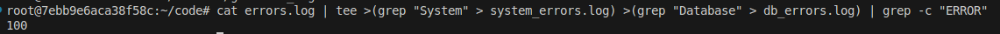
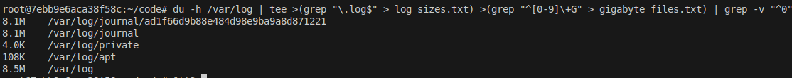
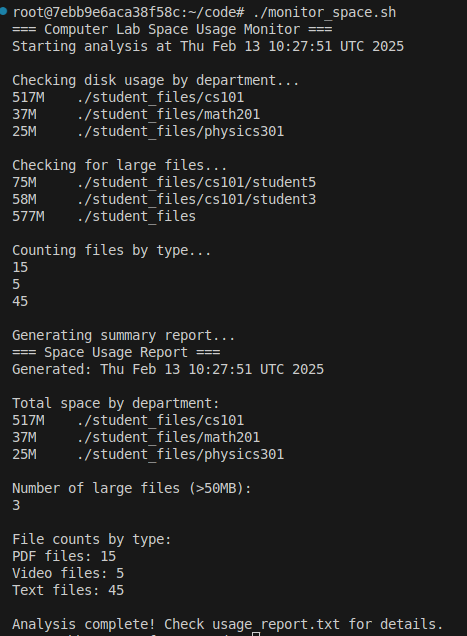
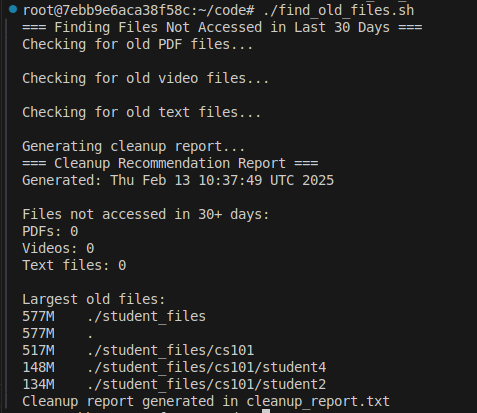

# Advanced Pipeline Operations: Processing Complex Data Streams

Advanced pipelines in Unix/Linux systems enable sophisticated data processing and analysis through the strategic combination of key utilities. This guide focuses on mastering du, grep, and tee commands with process substitution for efficient file and text processing.


## Learning Objectives

By the end of this guide, you will understand:
- Advanced use of du for disk space analysis
- Complex pattern matching with grep
- Multi-stream processing using tee and process substitution
- Real-time monitoring and filtering techniques

## Key Commands and Utilities

### Disk Usage Analysis (du)
- Purpose: Estimates file and directory space usage
- Common options:
  - `-h`: Human-readable sizes (1K, 234M, 2G)
  - `-s`: Display only a total for each argument
  - `-a`: Show sizes for all files, not just directories
  - `-c`: Produce a grand total
  - `--time`: Show last modification time

### Pattern Matching and Filtering (grep)
- Purpose: Searches for patterns in text
- Common options:
  - `-E`: Extended regular expressions
  - `-v`: Invert match (show non-matching lines)
  - `-c`: Count matching lines
  - `-i`: Case-insensitive search
  - `-r`: Recursive search
  - `-l`: List only filenames containing matches

### Stream Duplication (tee)
- Purpose: Read from stdin and write to stdout and files
- Common options:
  - `-a`: Append to files instead of overwriting
  - `-i`: Ignore interrupt signals

### Process Substitution
- Syntax: `>(command)` or `<(command)`
- Purpose: Treats command output as a file
- Enables parallel processing streams
- Allows multiple outputs from single input

## 1. Multi-Stream Log Analysis

### Create Sample Data
```bash
# Create the generate_logs.sh script
#Note: You can create a bash file on vscode then make it executable and run it. The below method is not mandatory!!
cat << 'EOF' > generate_logs.sh
#!/bin/bash
for i in {1..100}; do
    echo "[ERROR] System failure at $(date -d "@$((RANDOM + 1700000000))")" >> errors.log
    echo "[INFO] Normal operation at $(date -d "@$((RANDOM + 1700000000))")" >> info.log
done
EOF

# Make it executable
chmod +x generate_logs.sh

# Run the script
./generate_logs.sh
```

### Process Multiple Streams
```bash
cat errors.log | tee >(grep "System" > system_errors.log) >(grep "Database" > db_errors.log) | grep -c "ERROR"
```

What Happens? (Step by Step)
1. `cat errors.log`
   - Reads the error log file
   - Sends content to stdout

2. `tee` with process substitution:
   - Creates three simultaneous streams:
     a. First `>(grep "System" > system_errors.log)`
        - Filters lines containing "System"
        - Saves matches to system_errors.log
     b. Second `>(grep "Database" > db_errors.log)`
        - Filters lines containing "Database"
        - Saves matches to db_errors.log
     c. Main output continues to next command

3. `grep -c "ERROR"`
   - Counts lines containing "ERROR"
   - Displays total count

## 2. Disk Space Monitoring

### Complex Directory Analysis
```bash
du -h /var/log | tee >(grep "\.log$" > log_sizes.txt) >(grep "^[0-9]\+G" > gigabyte_files.txt) | grep -v "^0"
```

What Happens? (Step by Step)
1. `du -h /var/log`
   - Scans /var/log directory recursively
   - Outputs human-readable sizes
   - Format: size path

2. `tee` with process substitution:
   - First stream: `>(grep "\.log$" > log_sizes.txt)`
     - Captures sizes of .log files
     - Saves to log_sizes.txt
   - Second stream: `>(grep "^[0-9]\+G" > gigabyte_files.txt)`
     - Captures files/directories >= 1GB
     - Saves to gigabyte_files.txt
   - Main output continues

3. `grep -v "^0"`
   - Filters out entries starting with 0
   - Shows only non-empty items

## Real-World Scenario: Web Server Log Analysis

Imagine you're an IT assistant at a college computer lab. It's finals week, and students are complaining about computers running slowly and running out of disk space. Your supervisor asks you to:
1. Monitor the disk usage of student directories
2. Track which file types are taking up the most space
3. Keep logs of your findings for future reference

### 1. Generate Sample Student Data

First, let's create some sample data to work with:

```bash
# Create the generate_student_data.sh script
cat << 'EOF' > generate_student_data.sh
#!/bin/bash

# Create student directories and sample files
mkdir -p ./student_files/{cs101,math201,physics301}/student{1..5}

# Generate random sized files of different types
for dept in cs101 math201 physics301; do
    for student in {1..5}; do
        # Create PDF files (homework submissions)
        dd if=/dev/zero of=./student_files/$dept/student$student/homework.pdf bs=1M count=$((RANDOM % 10 + 1)) 2>/dev/null
        
        # Create large video files for multimedia students
        if [ "$dept" = "cs101" ]; then
            dd if=/dev/zero of=./student_files/$dept/student$student/project.mp4 bs=1M count=$((RANDOM % 100 + 50)) 2>/dev/null
        fi
        
        # Create text files for all students
        for i in {1..3}; do
            echo "Sample notes content" > ./student_files/$dept/student$student/notes$i.txt
        done
    done
done
EOF

# Make it executable
chmod +x generate_student_data.sh

# Run the script
./generate_student_data.sh
```

### 2. Create Space Usage Monitor

Now, let's create a script to monitor disk usage and generate reports:

```bash
# Create the monitor_space.sh script
cat << 'EOF' > monitor_space.sh
#!/bin/bash

echo "=== Computer Lab Space Usage Monitor ==="
echo "Starting analysis at $(date)"
echo

# Check disk usage and save to log
echo "Checking disk usage by department..."
du -sh ./student_files/* | grep -v "student[0-9]" | tee department_usage.log

# Find and log large files (>50MB)
echo -e "\nChecking for large files..."
du -h ./student_files | grep "[0-9]\\+G\\|[5-9][0-9]M" | tee large_files.log

# Count and log files by type
echo -e "\nCounting files by type..."
find ./student_files -name "*.pdf" | wc -l | tee pdf_count.log
find ./student_files -name "*.mp4" | wc -l | tee video_count.log
find ./student_files -name "*.txt" | wc -l | tee text_count.log

# Generate summary report
echo -e "\nGenerating summary report..."
{
    echo "=== Space Usage Report ==="
    echo "Generated: $(date)"
    echo -e "\nTotal space by department:"
    cat department_usage.log
    echo -e "\nNumber of large files (>50MB):"
    wc -l < large_files.log
    echo -e "\nFile counts by type:"
    echo "PDF files: $(cat pdf_count.log)"
    echo "Video files: $(cat video_count.log)"
    echo "Text files: $(cat text_count.log)"
} | tee usage_report.txt

echo -e "\nAnalysis complete! Check usage_report.txt for details."
EOF

# Make it executable
chmod +x monitor_space.sh

# Run the script
./monitor_space.sh
```


### 3. Create Cleanup Analysis Script

Finally, let's create a script to find old files:

```bash
# Create the find_old_files.sh script
cat << 'EOF' > find_old_files.sh
#!/bin/bash

echo "=== Finding Files Not Accessed in Last 30 Days ==="

# Find old PDFs
echo "Checking for old PDF files..."
find ./student_files -type f -name "*.pdf" -atime +30 | tee old_pdfs.log

# Find old videos
echo -e "\nChecking for old video files..."
find ./student_files -type f -name "*.mp4" -atime +30 | tee old_videos.log

# Find old text files
echo -e "\nChecking for old text files..."
find ./student_files -type f -name "*.txt" -atime +30 | tee old_texts.log

# Generate cleanup report
echo -e "\nGenerating cleanup report..."
{
    echo "=== Cleanup Recommendation Report ==="
    echo "Generated: $(date)"
    echo -e "\nFiles not accessed in 30+ days:"
    echo "PDFs: $(wc -l < old_pdfs.log)"
    echo "Videos: $(wc -l < old_videos.log)"
    echo "Text files: $(wc -l < old_texts.log)"
    echo -e "\nLargest old files:"
    du -h $(cat old_videos.log old_pdfs.log) 2>/dev/null | sort -rh | head -5
} | tee cleanup_report.txt

echo "Cleanup report generated in cleanup_report.txt"
EOF

# Make it executable
chmod +x find_old_files.sh

# Run the script
./find_old_files.sh
```



What Happens? (Step by Step)

1. First Script (generate_student_data.sh):
   - Creates a structured directory for three courses
   - Generates random-sized PDF and video files
   - Creates small text files for notes
   - Simulates a real computer lab environment

2. Second Script (monitor_space.sh):
   - Uses du to measure disk usage
   - Filters and saves department usage to department_usage.log
   - Finds large files and saves to large_files.log
   - Counts files by type and saves to separate logs
   - Creates a comprehensive usage report

3. Third Script (find_old_files.sh):
   - Searches for files older than 30 days
   - Saves different file types to separate logs
   - Creates a cleanup recommendation report
   - Lists the largest old files

## Learning Outcomes

This guide demonstrates how to:
- Process multiple data streams simultaneously
- Monitor disk usage effectively
- Filter and analyze log files in real-time
- Use process substitution for parallel processing
- Combine du, grep, and tee for powerful file analysis

Remember: These techniques are particularly valuable for system monitoring, log analysis, and resource tracking in production environments.