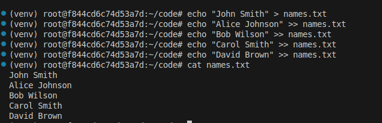
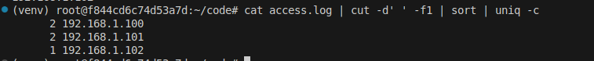
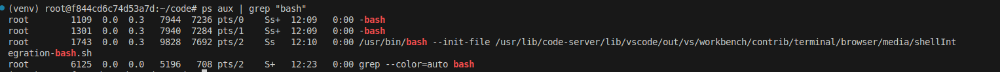
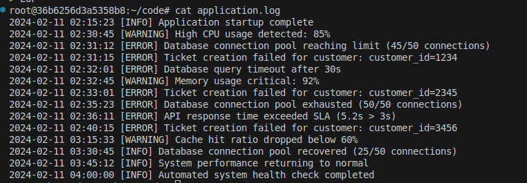
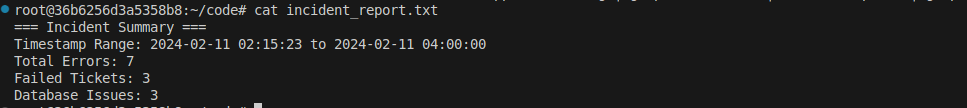

# Exploring Pipelines: Processing and Analyzing Data Streams

Pipelines are fundamental features in Unix/Linux that allow you to connect multiple commands together, where the output of one command becomes the input for the next. This powerful mechanism enables you to process and analyze data streams efficiently without creating intermediate files.....


## Learning Objectives

By the end of this lab, you will understand:
- How pipelines work in Unix/Linux systems
- Basic pipeline syntax using the pipe operator (|)
- Common command combinations for data processing
- Practical examples of data stream analysis


## What is a Pipeline?

A pipeline connects multiple commands by automatically sending the output (stdout) of one command to the input (stdin) of the next command. This allows you to perform complex data processing tasks by combining simple commands.

## 1. Basic Pipeline Example: Processing a List of Names

### Create and Populate the Input File

First, let's create a file with a list of names:

```bash
# Create the names.txt file
echo "John Smith" > names.txt
echo "Alice Johnson" >> names.txt
echo "Bob Wilson" >> names.txt
echo "Carol Smith" >> names.txt
echo "David Brown" >> names.txt
```

### Check the File Content
```bash
cat names.txt
```



What Happens?
- Displays the content of names.txt to verify our input

### Count the Number of Names
```bash
cat names.txt | wc -l
```


What Happens?
- `cat` reads the content of names.txt
- Output is piped to `wc -l`
- `wc -l` counts the number of lines

### Find Specific Names
```bash
cat names.txt | grep "Smith"
```


What Happens?
- Shows only lines containing "Smith"
- You should see both "John Smith" and "Carol Smith"

## 2. Processing Log Files

### Create a Sample Access Log
```bash
# Create sample access log entries
echo "192.168.1.100 - GET /index.html" > access.log
echo "192.168.1.101 - GET /about.html" >> access.log
echo "192.168.1.100 - GET /contact.html" >> access.log
echo "192.168.1.102 - GET /index.html" >> access.log
echo "192.168.1.101 - GET /products.html" >> access.log
```

### Count Unique IP Addresses
```bash
cat access.log | cut -d' ' -f1 | sort | uniq -c
```



What Happens?
- `cut -d' ' -f1` extracts the first field by setting whitespace as delimiter (IP address)
- `sort` arranges IP addresses
- `uniq -c` counts occurrences of each IP

### Find Specific Pages Accessed
```bash
cat access.log | grep "index.html" | wc -l
```


What Happens?
- Shows how many times index.html was accessed

## 3. Processing System Information

### List Running Processes
```bash
ps aux | grep "bash"
```



What Happens?
- `ps aux` lists all running processes
- `grep` filters for lines containing "bash"

### Check Disk Space Usage
```bash
df -h | grep "/dev/" | sort -rn -k5
```


What Happens?
- `df -h` shows disk space in human-readable format
- `grep "/dev/"` filters for actual devices
- `sort -rn -k5` sorts by usage percentage

# Real-World Scenario: Troubleshooting a Customer Service Platform

Imagine you're a DevOps engineer at TechCare, a growing customer service software company. One Monday morning, you receive an urgent message:

> "Several customers reported that our platform was responding slowly between 2 AM and 4 AM, and some support tickets weren't being created properly. Can you investigate what happened?"

## The Investigation Process

### 1. Generate Sample Application Logs

First, let's create a more realistic application log that mimics what you might see in production:

```bash
# Create a sample application log with timestamps
cat << 'EOF' > application.log
2024-02-11 02:15:23 [INFO] Application startup complete
2024-02-11 02:30:45 [WARNING] High CPU usage detected: 85%
2024-02-11 02:31:12 [ERROR] Database connection pool reaching limit (45/50 connections)
2024-02-11 02:31:15 [ERROR] Ticket creation failed for customer: customer_id=1234
2024-02-11 02:32:01 [ERROR] Database query timeout after 30s
2024-02-11 02:32:45 [WARNING] Memory usage critical: 92%
2024-02-11 02:33:01 [ERROR] Ticket creation failed for customer: customer_id=2345
2024-02-11 02:35:23 [ERROR] Database connection pool exhausted (50/50 connections)
2024-02-11 02:36:11 [ERROR] API response time exceeded SLA (5.2s > 3s)
2024-02-11 02:40:15 [ERROR] Ticket creation failed for customer: customer_id=3456
2024-02-11 03:15:33 [WARNING] Cache hit ratio dropped below 60%
2024-02-11 03:30:45 [INFO] Database connection pool recovered (25/50 connections)
2024-02-11 03:45:12 [INFO] System performance returning to normal
2024-02-11 04:00:00 [INFO] Automated system health check completed
EOF
```

What Happens?
- `cat << 'EOF'` starts a here-document, allowing multiple lines of text input
- The text between EOF markers is written to application.log
- Each log entry follows the format: timestamp + level + message

Let's verify the file was created:
```bash
cat application.log
```


### 2. Analysis Using Pipelines

#### Check Error Distribution
```bash
cat application.log | grep ERROR | cut -d' ' -f2 | cut -d: -f1 | sort | uniq -c
```


What Happens?
- `cat application.log` reads the content of the log file
- `grep ERROR` filters only lines containing "ERROR"
- First `cut -d' ' -f2` splits by space and takes the second field (time)
- Second `cut -d: -f1` splits the time by colon and takes the first field (hour)
- `sort` arranges the hours numerically
- `uniq -c` counts occurrences of each hour


#### Find Failed Ticket Creations
```bash
cat application.log | grep "Ticket creation failed" | cut -d= -f2
```


What Happens?
- `cat application.log` reads the log file
- `grep "Ticket creation failed"` filters for ticket creation failures
- `cut -d= -f2` splits each line at the '=' symbol and takes the second part (customer ID)


#### Analyze Database-Related Issues
```bash
cat application.log | grep -E "Database|connection pool" | cut -d' ' -f2,3,4,5,6,7,8,9
```


What Happens?
- `cat application.log` reads the log file
- `grep -E "Database|connection pool"` filters for lines containing either "Database" or "connection pool"
- `cut -d' ' -f2,3,4,5,6,7,8,9` extracts fields 2 through 9 (time and message) using space as delimiter


### 3. Creating a Summary Report

```bash
# Generate incident summary
echo "=== Incident Summary ===" > incident_report.txt
echo "Timestamp Range: $(head -n1 application.log | cut -d' ' -f1,2) to $(tail -n1 application.log | cut -d' ' -f1,2)" >> incident_report.txt
echo "Total Errors: $(cat application.log | grep ERROR | wc -l)" >> incident_report.txt
echo "Failed Tickets: $(cat application.log | grep "Ticket creation failed" | wc -l)" >> incident_report.txt
echo "Database Issues: $(cat application.log | grep -E "Database|connection pool" | grep ERROR | wc -l)" >> incident_report.txt
```

What Happens?
- First `echo` creates the report file with a header
- `head -n1` gets the first log entry, `tail -n1` gets the last entry
- `cut -d' ' -f1,2` extracts the timestamp from these entries
- `grep ERROR | wc -l` counts total error lines
- `grep "Ticket creation failed" | wc -l` counts failed ticket creations
- `grep -E "Database|connection pool" | grep ERROR | wc -l` counts database-related errors
- `>>` appends each line to the report file


Let's see the generated report:

```bash
cat incident_report.txt
```




### 4. Root Cause Analysis

Based on our pipeline analysis, we can determine:

1. The issues started around 2:30 AM with high CPU usage
2. Database connection pool became exhausted
3. This led to ticket creation failures for multiple customers
4. System recovered by 3:30 AM when connection pool returned to normal levels

### 5. Recommendations

After this analysis, you might recommend:
- Increasing the database connection pool size
- Implementing better connection pool monitoring
- Setting up alerts for when CPU usage exceeds 80%
- Creating automated recovery procedures for connection pool issues

## Learning Outcomes

This real-world scenario demonstrates how to:
- Use pipelines to analyze time-series log data
- Extract specific patterns from logs
- Generate incident reports
- Correlate different types of events
- Draw conclusions from log analysis

Remember: In real production environments, you might be dealing with logs spread across multiple servers and much larger file sizes. Tools like `grep`, `awk`, and `sed` combined with pipelines become even more valuable in such scenarios.