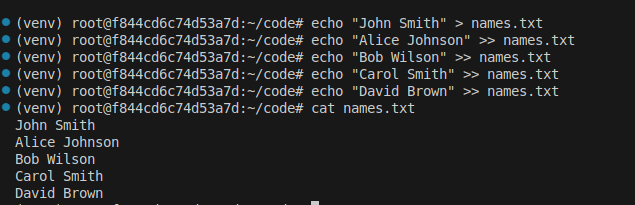
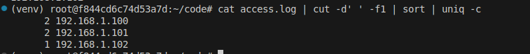
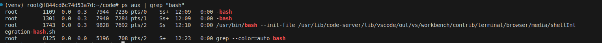
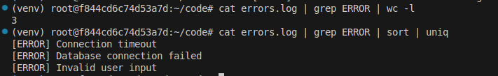

# Exploring Pipelines: Processing and Analyzing Data Streams

Pipelines are fundamental features in Unix/Linux that allow you to connect multiple commands together, where the output of one command becomes the input for the next. This powerful mechanism enables you to process and analyze data streams efficiently without creating intermediate files.


## Learning Objectives

By the end of this lab, you will understand:
- How pipelines work in Unix/Linux systems
- Basic pipeline syntax using the pipe operator (|)
- Common command combinations for data processing
- Practical examples of data stream analysis

## Prerequisites
- Basic knowledge of Linux/Unix command line
- A Linux environment or terminal with Bash shell

## What is a Pipeline?

A pipeline connects multiple commands by automatically sending the output (stdout) of one command to the input (stdin) of the next command. This allows you to perform complex data processing tasks by combining simple commands.

## 1. Basic Pipeline Example: Processing a List of Names

### Create and Populate the Input File

First, let's create a file with a list of names:

```bash
# Create the names.txt file
echo "John Smith" > names.txt
echo "Alice Johnson" >> names.txt
echo "Bob Wilson" >> names.txt
echo "Carol Smith" >> names.txt
echo "David Brown" >> names.txt
```

### Check the File Content
```bash
cat names.txt
```


What Happens?
- Displays the content of names.txt to verify our input

### Count the Number of Names
```bash
cat names.txt | wc -l
```

What Happens?
- `cat` reads the content of names.txt
- Output is piped to `wc -l`
- `wc -l` counts the number of lines

### Find Specific Names
```bash
cat names.txt | grep "Smith"
```


What Happens?
- Shows only lines containing "Smith"
- You should see both "John Smith" and "Carol Smith"

## 2. Processing Log Files

### Create a Sample Access Log
```bash
# Create sample access log entries
echo "192.168.1.100 - GET /index.html" > access.log
echo "192.168.1.101 - GET /about.html" >> access.log
echo "192.168.1.100 - GET /contact.html" >> access.log
echo "192.168.1.102 - GET /index.html" >> access.log
echo "192.168.1.101 - GET /products.html" >> access.log
```

### Count Unique IP Addresses
```bash
cat access.log | cut -d' ' -f1 | sort | uniq -c
```



What Happens?
- `cut -d' ' -f1` extracts the first field by setting whitespace as delimiter (IP address)
- `sort` arranges IP addresses
- `uniq -c` counts occurrences of each IP

### Find Specific Pages Accessed
```bash
cat access.log | grep "index.html" | wc -l
```


What Happens?
- Shows how many times index.html was accessed

## 3. Processing System Information

### List Running Processes
```bash
ps aux | grep "bash"
```


What Happens?
- `ps aux` lists all running processes
- `grep` filters for lines containing "bash"

### Check Disk Space Usage
```bash
df -h | grep "/dev/" | sort -rn -k5
```


What Happens?
- `df -h` shows disk space in human-readable format
- `grep "/dev/"` filters for actual devices
- `sort -rn -k5` sorts by usage percentage

## Practical Exercise: Create a Simple Log Analyzer

### Create a Sample Error Log
```bash
# Create sample error log
echo "[ERROR] Database connection failed" > errors.log
echo "[INFO] Application started" >> errors.log
echo "[ERROR] Invalid user input" >> errors.log
echo "[INFO] User logged in" >> errors.log
echo "[ERROR] Connection timeout" >> errors.log
```

### Analyze Error Log
```bash
# Count total errors
cat errors.log | grep ERROR | wc -l

# Show unique error messages
cat errors.log | grep ERROR | sort | uniq
```

## Conclusion

Through these exercises, you've learned how to:
- Create and manipulate files for pipeline processing
- Chain commands to analyze data
- Filter and count specific patterns in files
- Process system information efficiently

These pipeline skills will help you automate data processing tasks and create more efficient command-line operations. Remember to experiment with different combinations of commands to solve your specific data processing needs.